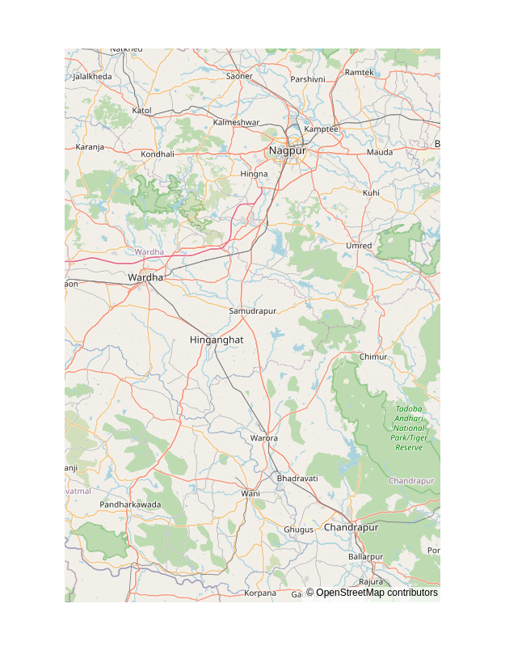

# House-Price-Predictions-in-India

<!--## At a Glance

Demo #1             |  Demo #2
:-------------------------:|:-------------------------:
  |  

> * Piecharts created through methods of data visualization.-->

## What is this?
A data science project that predicts the prices of houses in Mumbai based on sizes.

#### -- Project Status: [Ongoing]

## Project Intro/Objective
The purpose of this project is to determine if there are BHK(bathroom, hall, kitchen) houses in Mumbai that cost less than 1000 lacs.

### Methods Used
* Statistical Analysis
* Hypothesis Testing
* Data Visualization

### Technologies
* Python
* MS Excel
* Pycharm as IDE (or Jupyter)

## Project Description
This submodule of this repo is a price prediction of houses in Mumbai.
Detailed should be developed by the analyst based on his/her visualizations! ;)

## Needs of this project

- data exploration/descriptive statistics
- data processing/cleaning
- statistical modeling
- writeup/reporting (not yet developed)

## Getting Started

1. First, fork this repo using the Fork button at the top left of this repository.
2. Then clone it using the following command:
```sh
https://github.com/de-lia/House-Price-Predictions-in-India
```
3. Run it on it on your favorite editor. This project was originally using in Jupyter.
4. The various sections of comments represent chunks of code for the visualization of data.
Therefore, it'll be preferable to run the project in a virtual environment using Jupyter.

### If you're using Jupyter to open this project,
6. You can set up your venv using [this](https://www.geeksforgeeks.org/using-jupyter-notebook-in-virtual-environment/).
7. On your terminal, navigate to the directory of this project, and run:
```sh
jupyter notebook
```


