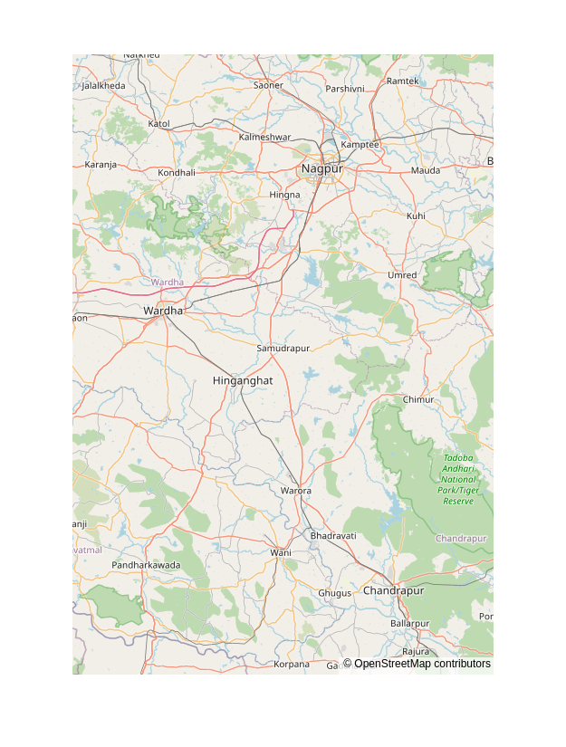

# House-Price-Predictions-in-India

<!--## At a Glance

Demo #1             |  Demo #2
:-------------------------:|:-------------------------:
  |  

> * Piecharts created through methods of data visualization.-->

## What is this?
A data science project ...

#### -- Project Status: [Ongoing]

## Project Intro/Objective
The purpose of this project is to ...

### Methods Used
<!--* Statistical Analysis
* Hypothesis Testing
* Data Visualization-->

### Technologies
* Python
* MS Excel
* Pycharm as IDE (or Jupyter)

## Project Description
This repository is a ...
Detailed should be developed by the analyst based on his/her visualizations! ;)

## Needs of this project
<!--
- data exploration/descriptive statistics
- data processing/cleaning
- statistical modeling
- writeup/reporting
-->

## Getting Started

1. First, clone this repository using the following command:
```sh
https://github.com/de-lia/House-Price-Predictions-in-India
```
2. Run it on it on your favorite editor. This project was originally using in Pycharm.
2. The various sections of comments represent chunks of code for the visualization of data.
3. Therefore, it'll be preferable to run the project in a virtual environment using Jupyter.
4. You can set up your venv using [this](https://www.geeksforgeeks.org/using-jupyter-notebook-in-virtual-environment/).
5. Navigate to the directory of this project, and run:
```sh
jupyter notebook
```


